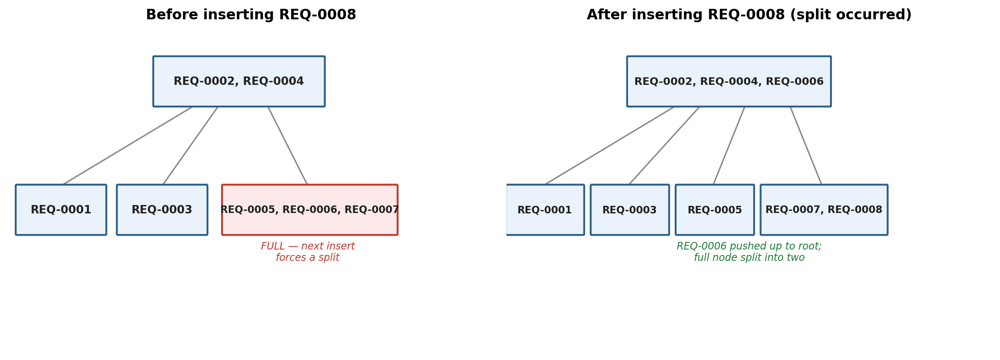
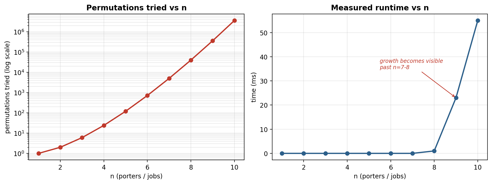

# B3 — B-tree and Brute Force

**ID: 22390683**
*Gyankomah Samuel Offei-Dei — Pod B (Trees, Hashing & Indexing)*

## 1. Role and Purpose

Slot B3 owns two components within the Ghana Smart Service Operations Optimizer: a B-tree data structure, and a brute-force algorithm. Together they answer a specific part of the system's core question — how service requests are indexed for fast lookup, and how a small set of porters can be optimally matched to a small set of pending jobs.

## 2. Data Structure: B-tree

The B-tree acts as a page index over the growing request and runs tables. Rather than storing one value per node as in a plain binary search tree, each node holds multiple sorted keys (up to 2t−1, where t is the tree's minimum degree). This keeps the tree shallow and wide, so lookups stay fast even as the number of service requests grows into the hundreds or thousands. When a node fills to capacity and a new key needs to be inserted, the node splits into two, and its median key is promoted into the parent node — the mechanism that keeps the tree balanced.

Implementation notes: built entirely on plain arrays (no `java.util.TreeMap`, `HashMap`, or other banned built-ins). The `Node` class is a static generic nested class rather than a plain inner class — a non-static inner class of a generic outer class cannot have arrays created of it in Java (a compiler restriction), so `Node` was declared as its own generic class, the same pattern `java.util.HashMap` uses internally for the same reason.

*Figure 1 — Real output from BTreeTraceDemo, run against real requestIds from the loaded dataset: the tree immediately before inserting REQ-0008 (left, one node already full), and immediately after (right), showing the full node splitting into two and REQ-0006 being promoted to the root.*

### 2.1 Complexity

Search and insert are both O(log n), since the tree height grows logarithmically with the number of keys — a direct result of each node holding multiple keys instead of one.

### 2.2 Test Coverage

| Case | What it verifies | Result |
|---|---|---|
| Normal | Insert several keys; each is found via `search()` with the correct value. | Pass |
| Boundary | Insert enough keys to force a real node split; every key — including ones moved by the split — remains correctly findable afterward. | Pass |
| Invalid input | Searching a key that was never inserted returns null (not an exception); inserting a null key throws `NullPointerException` immediately rather than corrupting the tree. | Pass |

All 4 tests pass (`BTreeTest.java`). One known limitation: deletion is not yet implemented — only insert and search.

## 3. Algorithm: Brute Force (Porter-to-Job Assignment)

Given a set of available porters and a set of pending jobs, the algorithm tries every possible one-to-one pairing (every permutation), computes the total cost of each, and keeps whichever pairing has the lowest total cost. It is exhaustive by design — correct by definition, since it never skips a candidate solution — which makes it a useful correctness baseline to compare faster, heuristic approaches (such as a greedy assignment) against.

Implementation notes: porters and jobs are represented as a square cost matrix; permutations are generated via recursive swapping (Heap-style backtracking) rather than any built-in permutation utility. No `java.util.PriorityQueue`, `Stack`, `ArrayDeque`, `HashMap`, or `TreeMap` is used anywhere in this class.

Worked example using real data: 4 available porters (RES-P01–RES-P04, from `resources_template`) matched against 4 real pending requests (REQ-0005, REQ-0008, REQ-0010, REQ-0012, status = PENDING, from `service_requests_template`). The algorithm checked all 4! = 24 possible pairings and found the minimum-cost assignment: RES-P01→REQ-0008, RES-P02→REQ-0010, RES-P03→REQ-0012, RES-P04→REQ-0005, total cost 28. Note: the cost values themselves remain representative placeholders, since real routing cost (travelTime × roadConditionWeight between a porter's location and a job's source location) depends on the graph/routing API, owned by C2/C4 and not yet available — the porter and job identities are real; the distances between them are not yet.

*Figure 2 — Real output from BruteForceTraceDemo, timing run against the real dataset: permutations tried (left, log scale) and measured wall-clock time (right) as the number of porters/jobs increases from 1 to 10. Both curves are effectively flat until n≈7, then climb sharply — concrete evidence that the exhaustive approach only remains practical for small n.*

### 3.1 Complexity

O(n!) — factorial — since every permutation of jobs is generated and scored. This is precisely the property the growth chart above demonstrates: 3.6 million permutations and 55ms at n=10, versus effectively instant at n=7 and below.

### 3.2 Test Coverage

| Case | What it verifies | Result |
|---|---|---|
| Normal | A 3×3 cost matrix with a hand-verified optimal assignment (total cost 9 across all 3! = 6 permutations tried). | Pass |
| Boundary | Smallest valid input — a single porter and single job — resolves correctly without error. | Pass |
| Invalid input | A non-square matrix (unequal porters vs jobs) throws `IllegalArgumentException`; a null matrix throws `NullPointerException`. | Pass |

All 4 tests pass (`BruteForceAssignmentTest.java`). Known limitation: only practical for small n by design — not intended for direct use against the full 300-request dataset.

## 4. Current Status and Next Steps

Both components are implemented and tested (8 tests total, all passing). Evidence was originally generated using representative sample data while the real dataset was still being built by A3; as of 06/08/2026, the real dataset (`service_requests_template`, `resources_template`, `locations_template`, `roads_template`) was loaded and both evidence generators (`BTreeTraceDemo`, `BruteForceTraceDemo`) were re-run against real requestId and porter/job values — the figures and results shown above are from that real-data run, not the earlier sample run. No change to the underlying B-tree or brute-force implementation was required to make this swap, since both were built generically from the start.

Remaining known gap: brute-force cost values are still representative placeholders rather than real routing distances, since that requires the graph/routing API (owned by C2/C4), which is not yet frozen or available. This section will be updated again once that dependency is resolved.
